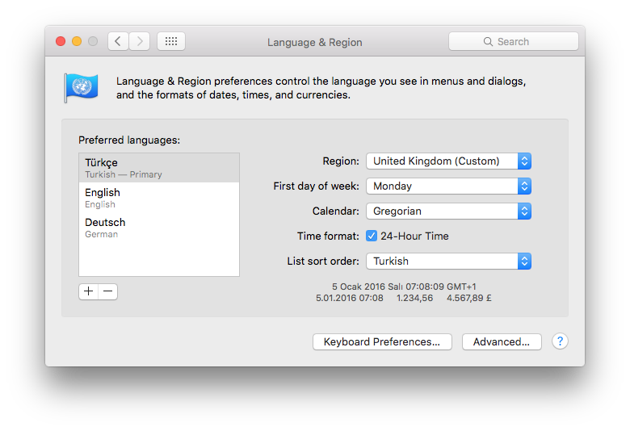

This is a reproducable case for a bug report. See https://liquibase.jira.com/browse/CORE-2772

# INSTRUCTIONS

I couldn't reproduce the problem with Docker.
Maybe it is just a Mac issue.

## Language + Locale

Set your language to Turkish. As shown here (no need to restart your machine):

### Initialize the database and the user

    cat setup.sql | mysql -u <YOUR-ROOTish-USER> -p

### Initiate!

    java \
    -classpath .:lib/* \
    -Dliquibase.databaseChangeLogTableName="test_db_changelog" \
    -Dliquibase.databaseChangeLogLockTableName="test_db_changeloglock" \
    liquibase.integration.commandline.Main "--defaultsFile=liquibase.properties" \
    --logLevel=debug update

### Teardown: Drop the database and user

    cat teardown.sql | mysql -u <YOUR-ROOTish-USER> -p

### My environment

    $ mysql --version
    > mysql  Ver 14.14 Distrib 5.5.35, for osx10.6 (i386) using readline 5.1

    $ java -version
    > java version "1.7.0_71"
    > Java(TM) SE Runtime Environment (build 1.7.0_71-b14)
    > Java HotSpot(TM) 64-Bit Server VM (build 24.71-b01, mixed mode)

    $ uname -a
    > Darwin aliMBP.local 15.3.0 Darwin Kernel Version 15.3.0: Thu Dec 10 18:40:58 PST 2015; root:xnu-3248.30.4~1/RELEASE_X86_64 x86_64 i386 MacBookPro11,3 Darwin

### Log
    DEBUG 25.05.2016 22:05: liquibase: Connected to somebody@localhost@jdbc:mysql://localhost:3306/liquibasetr
    DEBUG 25.05.2016 22:05: liquibase: Setting auto commit to false from true
    DEBUG 25.05.2016 22:05: liquibase: Computed checksum for 1464206705478 as 7dd710ddceef7fa8afdc6f0aef2ad62f
    DEBUG 25.05.2016 22:05: liquibase: Executing QUERY database command: select count(*) from liquibasetr.test_db_changeloglock
    DEBUG 25.05.2016 22:05: liquibase: Executing QUERY database command: SELECT LOCKED FROM liquibasetr.test_db_changeloglock WHERE ID=1
    DEBUG 25.05.2016 22:05: liquibase: Lock Database
    DEBUG 25.05.2016 22:05: liquibase: Executing UPDATE database command: UPDATE liquibasetr.test_db_changeloglock SET LOCKED = 1, LOCKEDBY = 'aliMBP.local (fe80:0:0:0:80d4:b2ff:fe91:81d6%9)', LOCKGRANTED = '2016-05-25 22:05:05.528' WHERE ID = 1 AND LOCKED = 0
    INFO 25.05.2016 22:05: liquibase: Successfully acquired change log lock
    DEBUG 25.05.2016 22:05: liquibase: Resolving XML entity name='null', publicId='null', baseURI='null', systemId='http://www.liquibase.org/xml/ns/dbchangelog/dbchangelog-3.1.xsd'
    DEBUG 25.05.2016 22:05: liquibase: Found namespace details class liquibase.parser.core.xml.StandardNamespaceDetails for http://www.liquibase.org/xml/ns/dbchangelog/dbchangelog-3.1.xsd
    DEBUG 25.05.2016 22:05: liquibase: Local path for http://www.liquibase.org/xml/ns/dbchangelog/dbchangelog-3.1.xsd is liquibase/parser/core/xml/dbchangelog-3.1.xsd
    DEBUG 25.05.2016 22:05: liquibase: Successfully loaded XSD from liquibase/parser/core/xml/dbchangelog-3.1.xsd
    DEBUG 25.05.2016 22:05: liquibase: Executing QUERY database command: SELECT MD5SUM FROM liquibasetr.test_db_changelog WHERE MD5SUM IS NOT NULL
    INFO 25.05.2016 22:05: liquibase: Reading from liquibasetr.test_db_changelog
    DEBUG 25.05.2016 22:05: liquibase: Executing QUERY database command: SELECT FILENAME,AUTHOR,ID,MD5SUM,DATEEXECUTED,ORDEREXECUTED,EXECTYPE,DESCRIPTION,COMMENTS,TAG,LIQUIBASE FROM liquibasetr.test_db_changelog ORDER BY DATEEXECUTED ASC, ORDEREXECUTED ASC
    DEBUG 25.05.2016 22:05: liquibase: master.xml: master.xml::001::generated: Running Changeset:master.xml::001::generated
    DEBUG 25.05.2016 22:05: liquibase: master.xml: master.xml::001::generated: Changeset master.xml::001::generated
    INFO 25.05.2016 22:05: liquibase: master.xml: master.xml::001::generated: Marking ChangeSet: master.xml::001::generated ran despite precondition failure due to onFail='MARK_RAN':
              master.xml : Not precondition failed

    DEBUG 25.05.2016 22:05: liquibase: master.xml: master.xml::001::generated: Skipping ChangeSet: master.xml::001::generated
    DEBUG 25.05.2016 22:05: liquibase: master.xml: master.xml::001::generated: Executing QUERY database command: SELECT MAX(ORDEREXECUTED) FROM liquibasetr.test_db_changelog
    DEBUG 25.05.2016 22:05: liquibase: master.xml: master.xml::001::generated: Computed checksum for createTable:[
        columns=[
            [
                [
                    nullable="false"
                ]
                name="id"
                type="VARCHAR(255)"
            ],
            [
                name="alias"
                type="VARCHAR(255)"
            ]
        ]
        tableName="Installation"
    ] as e717b2cdf22fd3e0b15786b0991be2c8
    DEBUG 25.05.2016 22:05: liquibase: master.xml: master.xml::001::generated: Computed checksum for 7:e717b2cdf22fd3e0b15786b0991be2c8: as ad3dbb54fa50563a5fb8c556f2b71b0f
    DEBUG 25.05.2016 22:05: liquibase: master.xml: master.xml::001::generated: Executing EXECUTE database command: INSERT INTO liquibasetr.test_db_changelog (ID, AUTHOR, FILENAME, DATEEXECUTED, ORDEREXECUTED, MD5SUM, DESCRIPTION, COMMENTS, EXECTYPE, LIQUIBASE) VALUES ('001', 'generated', 'master.xml', NOW(), 4, '7:ad3dbb54fa50563a5fb8c556f2b71b0f', 'createTable', '', 'MARK_RAN', '3.3.2')
    DEBUG 25.05.2016 22:05: liquibase: master.xml: master.xml::001::generated: Computed checksum for createTable:[
        columns=[
            [
                [
                    nullable="false"
                ]
                name="id"
                type="VARCHAR(255)"
            ],
            [
                name="alias"
                type="VARCHAR(255)"
            ]
        ]
        tableName="Installation"
    ] as e717b2cdf22fd3e0b15786b0991be2c8
    DEBUG 25.05.2016 22:05: liquibase: master.xml: master.xml::001::generated: Computed checksum for 7:e717b2cdf22fd3e0b15786b0991be2c8: as ad3dbb54fa50563a5fb8c556f2b71b0f
    DEBUG 25.05.2016 22:05: liquibase: master.xml: master.xml::002::generated: Running Changeset:master.xml::002::generated
    DEBUG 25.05.2016 22:05: liquibase: master.xml: master.xml::002::generated: Changeset master.xml::002::generated
    SEVERE 25.05.2016 22:05: liquibase: master.xml: master.xml::002::generated: Change Set master.xml::002::generated failed.  Error: Migration failed for change set master.xml::002::generated:
         Reason:
              master.xml : liquibase.precondition.core.PrimaryKeyExistsPrecondition@669251cc : Table 'liquibasetr.?nstallation' doesn't exist

    liquibase.exception.MigrationFailedException: Migration failed for change set master.xml::002::generated:
         Reason:
              master.xml : liquibase.precondition.core.PrimaryKeyExistsPrecondition@669251cc : Table 'liquibasetr.?nstallation' doesn't exist

    	at liquibase.changelog.ChangeSet.execute(ChangeSet.java:514)
    	at liquibase.changelog.visitor.UpdateVisitor.visit(UpdateVisitor.java:43)
    	at liquibase.changelog.ChangeLogIterator.run(ChangeLogIterator.java:73)
    	at liquibase.Liquibase.update(Liquibase.java:200)
    	at liquibase.integration.commandline.Main.doMigration(Main.java:1044)
    	at liquibase.integration.commandline.Main.run(Main.java:175)
    	at liquibase.integration.commandline.Main.main(Main.java:94)
    Caused by: liquibase.exception.PreconditionErrorException: Precondition Error
    	at liquibase.precondition.core.PrimaryKeyExistsPrecondition.check(PrimaryKeyExistsPrecondition.java:89)
    	at liquibase.precondition.core.NotPrecondition.check(NotPrecondition.java:38)
    	at liquibase.precondition.core.AndPrecondition.check(AndPrecondition.java:43)
    	at liquibase.precondition.core.PreconditionContainer.check(PreconditionContainer.java:201)
    	at liquibase.changelog.ChangeSet.execute(ChangeSet.java:471)
    	... 6 more
    Caused by: liquibase.exception.DatabaseException: com.mysql.jdbc.exceptions.jdbc4.MySQLSyntaxErrorException: Table 'liquibasetr.?nstallation' doesn't exist
    	at liquibase.snapshot.ResultSetCache.get(ResultSetCache.java:78)
    	at liquibase.snapshot.JdbcDatabaseSnapshot$CachingDatabaseMetaData.getPrimaryKeys(JdbcDatabaseSnapshot.java:448)
    	at liquibase.snapshot.jvm.PrimaryKeySnapshotGenerator.snapshotObject(PrimaryKeySnapshotGenerator.java:39)
    	at liquibase.snapshot.jvm.JdbcSnapshotGenerator.snapshot(JdbcSnapshotGenerator.java:60)
    	at liquibase.snapshot.SnapshotGeneratorChain.snapshot(SnapshotGeneratorChain.java:50)
    	at liquibase.snapshot.DatabaseSnapshot.include(DatabaseSnapshot.java:163)
    	at liquibase.snapshot.DatabaseSnapshot.init(DatabaseSnapshot.java:60)
    	at liquibase.snapshot.DatabaseSnapshot.<init>(DatabaseSnapshot.java:37)
    	at liquibase.snapshot.JdbcDatabaseSnapshot.<init>(JdbcDatabaseSnapshot.java:25)
    	at liquibase.snapshot.SnapshotGeneratorFactory.createSnapshot(SnapshotGeneratorFactory.java:126)
    	at liquibase.snapshot.SnapshotGeneratorFactory.createSnapshot(SnapshotGeneratorFactory.java:134)
    	at liquibase.snapshot.SnapshotGeneratorFactory.has(SnapshotGeneratorFactory.java:88)
    	at liquibase.precondition.core.PrimaryKeyExistsPrecondition.check(PrimaryKeyExistsPrecondition.java:79)
    	... 10 more
    Caused by: com.mysql.jdbc.exceptions.jdbc4.MySQLSyntaxErrorException: Table 'liquibasetr.?nstallation' doesn't exist
    	at sun.reflect.NativeConstructorAccessorImpl.newInstance0(Native Method)
    	at sun.reflect.NativeConstructorAccessorImpl.newInstance(NativeConstructorAccessorImpl.java:57)
    	at sun.reflect.DelegatingConstructorAccessorImpl.newInstance(DelegatingConstructorAccessorImpl.java:45)
    	at java.lang.reflect.Constructor.newInstance(Constructor.java:526)
    	at com.mysql.jdbc.Util.handleNewInstance(Util.java:411)
    	at com.mysql.jdbc.Util.getInstance(Util.java:386)
    	at com.mysql.jdbc.SQLError.createSQLException(SQLError.java:1052)
    	at com.mysql.jdbc.MysqlIO.checkErrorPacket(MysqlIO.java:3609)
    	at com.mysql.jdbc.MysqlIO.checkErrorPacket(MysqlIO.java:3541)
    	at com.mysql.jdbc.MysqlIO.sendCommand(MysqlIO.java:2002)
    	at com.mysql.jdbc.MysqlIO.sqlQueryDirect(MysqlIO.java:2163)
    	at com.mysql.jdbc.ConnectionImpl.execSQL(ConnectionImpl.java:2618)
    	at com.mysql.jdbc.ConnectionImpl.execSQL(ConnectionImpl.java:2568)
    	at com.mysql.jdbc.StatementImpl.executeQuery(StatementImpl.java:1557)
    	at com.mysql.jdbc.DatabaseMetaData$7.forEach(DatabaseMetaData.java:3967)
    	at com.mysql.jdbc.IterateBlock.doForAll(IterateBlock.java:51)
    	at com.mysql.jdbc.DatabaseMetaData.getPrimaryKeys(DatabaseMetaData.java:3951)
    	at liquibase.snapshot.JdbcDatabaseSnapshot$CachingDatabaseMetaData$6.fastFetchQuery(JdbcDatabaseSnapshot.java:479)
    	at liquibase.snapshot.ResultSetCache$SingleResultSetExtractor.fastFetch(ResultSetCache.java:282)
    	at liquibase.snapshot.ResultSetCache.get(ResultSetCache.java:56)
    	... 22 more
    DEBUG 25.05.2016 22:05: liquibase: master.xml::002::generated: Release Database Lock
    DEBUG 25.05.2016 22:05: liquibase: master.xml::002::generated: Executing UPDATE database command: UPDATE liquibasetr.test_db_changeloglock SET LOCKED = 0, LOCKEDBY = NULL, LOCKGRANTED = NULL WHERE ID = 1
    INFO 25.05.2016 22:05: liquibase: master.xml::002::generated: Successfully released change log lock
    Unexpected error running Liquibase: Precondition Error

    SEVERE 25.05.2016 22:05: liquibase: master.xml::002::generated: Precondition Error
    liquibase.exception.MigrationFailedException: Migration failed for change set master.xml::002::generated:
         Reason:
              master.xml : liquibase.precondition.core.PrimaryKeyExistsPrecondition@669251cc : Table 'liquibasetr.?nstallation' doesn't exist

    	at liquibase.changelog.ChangeSet.execute(ChangeSet.java:514)
    	at liquibase.changelog.visitor.UpdateVisitor.visit(UpdateVisitor.java:43)
    	at liquibase.changelog.ChangeLogIterator.run(ChangeLogIterator.java:73)
    	at liquibase.Liquibase.update(Liquibase.java:200)
    	at liquibase.integration.commandline.Main.doMigration(Main.java:1044)
    	at liquibase.integration.commandline.Main.run(Main.java:175)
    	at liquibase.integration.commandline.Main.main(Main.java:94)
    Caused by: liquibase.exception.PreconditionErrorException: Precondition Error
    	at liquibase.precondition.core.PrimaryKeyExistsPrecondition.check(PrimaryKeyExistsPrecondition.java:89)
    	at liquibase.precondition.core.NotPrecondition.check(NotPrecondition.java:38)
    	at liquibase.precondition.core.AndPrecondition.check(AndPrecondition.java:43)
    	at liquibase.precondition.core.PreconditionContainer.check(PreconditionContainer.java:201)
    	at liquibase.changelog.ChangeSet.execute(ChangeSet.java:471)
    	... 6 more
    Caused by: liquibase.exception.DatabaseException: com.mysql.jdbc.exceptions.jdbc4.MySQLSyntaxErrorException: Table 'liquibasetr.?nstallation' doesn't exist
    	at liquibase.snapshot.ResultSetCache.get(ResultSetCache.java:78)
    	at liquibase.snapshot.JdbcDatabaseSnapshot$CachingDatabaseMetaData.getPrimaryKeys(JdbcDatabaseSnapshot.java:448)
    	at liquibase.snapshot.jvm.PrimaryKeySnapshotGenerator.snapshotObject(PrimaryKeySnapshotGenerator.java:39)
    	at liquibase.snapshot.jvm.JdbcSnapshotGenerator.snapshot(JdbcSnapshotGenerator.java:60)
    	at liquibase.snapshot.SnapshotGeneratorChain.snapshot(SnapshotGeneratorChain.java:50)
    	at liquibase.snapshot.DatabaseSnapshot.include(DatabaseSnapshot.java:163)
    	at liquibase.snapshot.DatabaseSnapshot.init(DatabaseSnapshot.java:60)
    	at liquibase.snapshot.DatabaseSnapshot.<init>(DatabaseSnapshot.java:37)
    	at liquibase.snapshot.JdbcDatabaseSnapshot.<init>(JdbcDatabaseSnapshot.java:25)
    	at liquibase.snapshot.SnapshotGeneratorFactory.createSnapshot(SnapshotGeneratorFactory.java:126)
    	at liquibase.snapshot.SnapshotGeneratorFactory.createSnapshot(SnapshotGeneratorFactory.java:134)
    	at liquibase.snapshot.SnapshotGeneratorFactory.has(SnapshotGeneratorFactory.java:88)
    	at liquibase.precondition.core.PrimaryKeyExistsPrecondition.check(PrimaryKeyExistsPrecondition.java:79)
    	... 10 more
    Caused by: com.mysql.jdbc.exceptions.jdbc4.MySQLSyntaxErrorException: Table 'liquibasetr.?nstallation' doesn't exist
    	at sun.reflect.NativeConstructorAccessorImpl.newInstance0(Native Method)
    	at sun.reflect.NativeConstructorAccessorImpl.newInstance(NativeConstructorAccessorImpl.java:57)
    	at sun.reflect.DelegatingConstructorAccessorImpl.newInstance(DelegatingConstructorAccessorImpl.java:45)
    	at java.lang.reflect.Constructor.newInstance(Constructor.java:526)
    	at com.mysql.jdbc.Util.handleNewInstance(Util.java:411)
    	at com.mysql.jdbc.Util.getInstance(Util.java:386)
    	at com.mysql.jdbc.SQLError.createSQLException(SQLError.java:1052)
    	at com.mysql.jdbc.MysqlIO.checkErrorPacket(MysqlIO.java:3609)
    	at com.mysql.jdbc.MysqlIO.checkErrorPacket(MysqlIO.java:3541)
    	at com.mysql.jdbc.MysqlIO.sendCommand(MysqlIO.java:2002)
    	at com.mysql.jdbc.MysqlIO.sqlQueryDirect(MysqlIO.java:2163)
    	at com.mysql.jdbc.ConnectionImpl.execSQL(ConnectionImpl.java:2618)
    	at com.mysql.jdbc.ConnectionImpl.execSQL(ConnectionImpl.java:2568)
    	at com.mysql.jdbc.StatementImpl.executeQuery(StatementImpl.java:1557)
    	at com.mysql.jdbc.DatabaseMetaData$7.forEach(DatabaseMetaData.java:3967)
    	at com.mysql.jdbc.IterateBlock.doForAll(IterateBlock.java:51)
    	at com.mysql.jdbc.DatabaseMetaData.getPrimaryKeys(DatabaseMetaData.java:3951)
    	at liquibase.snapshot.JdbcDatabaseSnapshot$CachingDatabaseMetaData$6.fastFetchQuery(JdbcDatabaseSnapshot.java:479)
    	at liquibase.snapshot.ResultSetCache$SingleResultSetExtractor.fastFetch(ResultSetCache.java:282)
    	at liquibase.snapshot.ResultSetCache.get(ResultSetCache.java:56)
    	... 22 more
